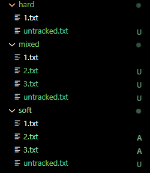
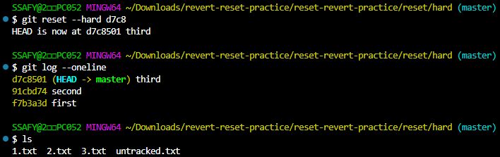

# Day 3 정리

## Git
> Git 이란?
분산 버전 관리 시스템

- Git은 3개의 영역이 존재

1. Working Directory
    - 현재 수정, 생성, 삭제된 파일들이 위치한 영역
    - `git status` 붉은 색으로 파일명 표시
        - untracked : 새로 생성된 파일
        - modified : 수정된 파일
        - deleted : 삭제된 파일
    - 해당 영역에 있는 파일은 commit에 기록되지 않음 (Staging Area로 이동시켜야 함)
2. Staging Area
    - a.k.a 분류소 (버전을 관리할 파일)
    - 버전 관리할 파일들을 모아두는 임시 영역
    - `git status`로 확인을 종종 할 필요가 있음
        - New file : 새로 생성된 파일
        - modified : 수정된 파일
3. Repository
    - 실제 버전 관리 내용이 저장되는 영역
    - `git log` Commit 이력 확인할 수 있음

## Git 기본 명령어

- `git add 파일명`
    - WD에서 SA로 파일을 이동시키는 명령어
    - `git add .` 현재 폴더의 모든 파일과 폴더를 SA로 이동
        - ※ 주의 : 버전 관리가 필요 없는 파일이나 폴더가 같이 올라갈 가능성이 있어 반드시 Staging Area를 확인해야 함

- `git commit `
    - 커밋 이력을 남기는 명령어
    - 반드시 커밋 메시지를 남겨야 함
    - `git commit -m "메시지"` : 해당 옵션으로 간단한 커밋 메시지를 남길 수 있음
> (참고) Vim 에디터 간단 사용법\
> vim 은 두가지 모드가 있음
> 1. Command 모드 : 저장, 나가기
> 2. Editor 모드 : 텍스트 수정
> - Editor 모드로 전환하는 방법은 키보드 i (또는 insert)를 누르면 됨
> - Command 모드로 전환하는 방법은 Esc 키
> - 저장하고 나가기 `:wq`
> - 저장하지 않고 강제로 나가기 `:q!`

## 내 PC(로컬 저장소)에 있는 버전을 서버(원격 저장소)에 올리기
> ### 원력저장소란?
> - 코드와 버전 관리 이력을 온라인 상의 특정 위치에 저장하여 여러 개발자가 협업하고 코드를 공유할 수 있는 저장 공간

`git remote add origin remote_repo_url`
git remote : 원격저장소
origin : 원격저장소 별명
remote_repo_url : 원격저장소 주소

local repo 하나 당 원격 repo 일일이 등록해야 함(여러 개 등록 가능)

> bash 창에서 붙여넣기 : shift + insert
`git remote -v` 연결된 원격저장소 확인
local repo에서 remote repo로 올리는 명령어 : `git push remote별명 branch명`

- Local Repo → Remote Repo
    - push 
- Remote Repo → Local Repo
    - pull
    - clone : 최초 1회만 (로컬에 레포가 없을 때. 즉 버전 정보가 없을 때)

**원격 저장소에는 commit이 올라감**
- commit 이력이 없다면 push 할 수 없음
- 버전이 꼬이지 않게 push를 생활화하자

`git clone remote_repo_url`
first_repo폴더 안에 .git 폴더가 들어있음 (.git 버전 정보가 들어있음)
- clone을 하면 git init 할 필요 없음

1. `git pull 별명(origin) 브랜치명(master)` 버전 정보 맞추기 위해
    - `git status`로 확인
2. `git add .` 커밋 이력 남기기
    - `git status`로 확인
3. git commit -m '작업내용'
4. `git push 별명(origin) 브랜치명(master)`

### 주의사항
- 같은 local repo 내에서 remote repo 명칭은 중복으로 사용 불가 (다른 .git 영역에선 동일한 명칭 사용 가능)
- 만약 local에서 github, lab.ssafy 모두에 연결했다면 github과 lab.ssafy는 서로 연결 X
local에서 수정사항 발생 시 github lab.ssafy 모두에 push 해야 함(싱크는 수동)

> **로컬 내 모든 파일을 github에 add-commit-push한 후, 하나의 파일만을 lab.ssafy에 add-commit-push 했다. 그런데 lab.ssafy에는 로컬 저장소의 모든 파일이 올라가 있었다. 왜 그럴까?**
> - commit한 이후 모든 파일이 버전 관리 대상으로 등록됨. 
> - 따라서 커밋 이후 SA는 비워지지만 SA에 파일을 일부만 올리고 커밋 후 push해도 모든 파일이 올라가게 됨
> - 이전에 [Repo1]에 push한 파일 중 일부만 [Repo2]에 push하고 싶다면 push하지 않을 파일을 버전 관리 대상에서 제외해야 함

## .gitignore
- git에서 특정 파일이나 디렉토리를 추적하지 않도록 설정하는 데 사용되는 텍스트 파일
    - 쉽게 생각해서 파일 블랙리스트
- PJT에 따라 공유하지 않아야 하는 것도 있기 때문에 사용

**예시**
1. .gitignore 파일 생성 (파일명 앞에 '.' 입력, 확장자 없음)
2. .gitignore 파일에 추적제외대상 파일명 입력 
3. 변경사항이 생겨도 git에서 추적 X

- .gitignore는 아직 추적대상이 아닌 파일들을 대상으로 동작
- commit이 한 번이라도 이루어지면 추적대상에 등록
    - .gitignore 생성시점은 **init 하고 난 직후**가 좋음

`gitignore.io` 에서 환경에 맞는 .gitignore 파일 자동으로 생성할 수 있음

### Github 활용하기
- TIL(Today I Learned)을 통해 내가 학습한 내용 기록
    - 매일 내가 배운 것을 마크다운으로 문서화
    - 단순 학습내용필기가 아닌 스스로 더 나아가 어떤 학습을 했는지를 기록
        - 학습 중 어떤 문제가 발생해서 어떻게 해결했는지 등...
- 개인 팀 프로젝트 코드 공유
- 오픈소스 프로젝트에 기여

[네이버는 레벨2 권장](https://d2.naver.com/news/3435170)

> README.md 파일이란?
> - 프로젝트 설명, 사용 방법 등 문서화된 정보 포함
> - .git/과 같은 위치에 있어야 함

### git 기타 명령어
- `git remove -v`
    - 현재 로컬 저장소에 등록된 원격 저장소 목록 보기
- `git remote rm 원격_저장소_이름`
    - 현재 로컬 저장소에 등록된 원격 저장소 삭제
    - 예) `git remote rm origin` : origin 원격 저장소 삭제

## git revert
-  특정 commit을 없었던 일로 만드는 작업 (변경이력 취소)
- 이전의 commit을 취소시키고 commit을 취소한 결과를 새로운 commit으로 남김 (재설정)

`git revert <commit_id>` : 해당 ID의 commit 취소
- revert 전

- revert 후

- 변경 사항을 안전하게 실행 취소할 수 있도록 도와주는 순방향 실행 취소 작업
- commit 기록에서 commit을 삭제하거나 분리하는 대신, ㅈ정된 변경 사항을 반전시키는 새 commit을 생성
- git에서 기록이 손실되는 것을 방지하며 기록의 무결성과 협업의 신뢰성을 높임

`git revert commit_id1 commit_id2 commit_id3` : 여러개 한 번에  revert\
`git revert commit_id1..commit_idn` : 연속된 여러개의 commit 한번에 revert\
`git revert --no-edit commit_id` : commit 메시지 작성을 위한 편집기를 열지 않음(자동으로 commit 진행)\
`git revert --no-commit commit_id`: 자동으로 commit 하지 않고 SA에만 올림

## git reset
> 특정 commit으로 되돌아가는 작업

`git reset [옵션] <commit_id>`

- 과거 시점으로 되돌아가는 작동 원리
- 특정 commit으로 되돌아갔을 때, 되돌아간 commit 이후의 commit은 모두 삭제

### reset의 3가지 옵션
1. `--soft` : 삭제한 commit의 기록을 staging area에 남김
    - reset 이전 :
    
    - reset 이후 :
    
        - `git log`시 first 커밋만 남아있음
        - staging area에 2.txt, 3.txt가 남아있음
2. `--mixed` : 삭제된 commit의 기록을 working directory에 남김(기본 옵션)
    - reset 이전 :
    
    - reset 이후 :
    
        - `git status`시 working directory에 
        - `git log`시 first로
3. `--hard` : 삭제된 commit의 기록을 남기지 않음 (통째로 버리기)
    - reset 이후 : 
    - 
        - mixed, soft와 달리 파일 자체가 wd에서 삭제됨

> `git reflog` : HEAD가 이전에 가리켰던 모든 commit 보여줌

> 지워진 commit도 reflog로 조회하여 복구 가능

- remote repo에 파일이 남아있다면 local repo에서 reset 하고 push 해도 remote repo로부터 pull 받으라는 메시지가 뜸 (싱크를 맞춰야 하기 때문)
    - **이 때 `git push -f`로 강제로 push 가능**

## 파일 내용을 modified 전으로 되돌리기

이미 커밋한 파일(?) 수정 후 저장했는데 가장 최근 커밋한 상태로 되돌리고 싶다?

`git restore` : WD의 파일을 수정 전으로 되돌림(?)
- git에서 관리되고 있는(한 번이라도 commit 찍힌) 파일을 대상으로 함
- 작업한거 다 날라갈 수도...

`git stash` : 
- `git stash apply`하면 다시 복구 가능

## Staging area에 올라간 파일을 Unstage하기
1. `git rm --cached`
    - commit이 없는 경우(새 파일인 경우)
    - staging area에 올라간 해당 파일을 추적 대상에서 삭제
    - 명령어 실행 시 WD로 이동(untracked file)
        - 주의 : `--cached` 붙이지 않으면 파일 자체 삭제
    - 예시) 이미 commit까지 찍힌 파일을 더 이상 추적하고 싶지 않을 때 사용 가능
        - 이후 .gitignore에 등록하여 추적대상에서 제외 가능
2. `git restore --staged`
    - git 저장소에 commit이 존재하는 경우

>> 추적을 시작하는 시점이 언제?
- commit 한 이후(staging area는 추적 대상 후보군)
- 하지만 staging area의 파일이 올라가면 추적 후보가 되기 때문에 .gitignore 의 경우 먹히지 않을 수 있음
--> .gitignore는 꼭!!! git init 직후에..

>> 같은 로컬 레포에서 레포A에는 파일 1,2,3을, 레포B에는 파일 1,2만을 올리고 싶다면?
- 각각 다른 파일을 SA에 올리고 push하게 되면 버전이 꼬일 수 있다
- 따라서 레포A용 브랜치와 레포B용 브랜치를 따로 파는 게 좋음
    - 그렇다면 .git 파일은 두개 생기는건가요?