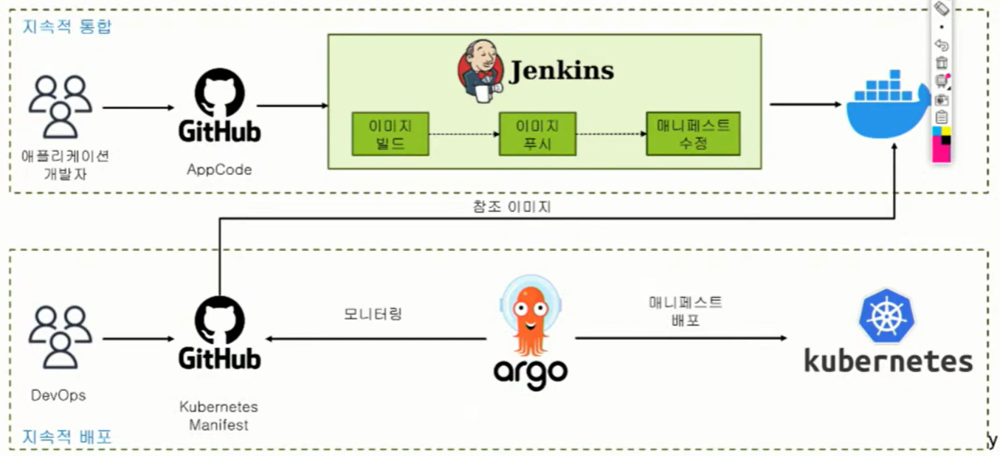

# CI/CD Pipeline in Cloud
https://www.youtube.com/watch?v=O6DN-Y2dBFk

https://github.com/moonjukhim/docker
암호: ssafy0102

- 클라우드 프로젝트 배포하기
  - 코드형 인프라(IaC)
  - CI/CD Pipeline
  - Jenkins를 사용한 CI 자동화
  - Argo CD를 사용한 CD 자동화
  - CI/CD 통합 및 결과 확인

## 코드형 인프라(IaC)

- AI의 발전으로 클라우드는 더 많이 활용될 것
- 클라우드로 가기 전에 가상화가 되어있어야 함.
- 네트워크 가상화, 서버 가상화, 스토리지 가상화 등
- 물리적인 자원을 직접 보여주지 않고 provision이 되면 사용자는 그런 기능을 API 호출을 통해 잘 갖다 쓰기만 하면 됨
- "Infrastructure as Code"
- 필요한 자원들을 코드로 정리하고 엔진을 통해 돌리면, 코드에 정의되어있던 자원들이 사용 가능한 형태로 provision됨
- 클라우드: 물리적인 자원이 안보이므로 개발 + 운영 이해 필요(DevOps)

### Security as Code

기존: 개발/ 운영 팀 따로
운영팀에서는 서버 네트워크 세팅. 리포지토리에 모은 코드를 빌드하고 테스트 환경에서 테스트 -> 운영 환경으로 배포

인프라 추상화/가상화 -> DevOps

개발과 운영 통합? 여기에 보안 추가
보안도 코드화 할 수 있다.

코드로 자원 재활용
DevOps 관점에서 개발은 신속하게. 그런데 그러면 문제 발생. Ops는 안정적으로
이 둘은 상충되는 개념. => 이걸 어떻게 결합할 수 있을까?

--> 자동화(CI/CD)
생산성을 높이고 사람의 실수를 줄이고 안정적으로 배포하려면.

- Micro Service Architecture(MSA)
하나의 큰 프로그램을 잘게 쪼갬. 잘개 쪼개진 서비스
한 쪽 서비스에 문제가 생겨도 다른 서비스에 영향을 주지 않도록 분산된 환경에서 동작하는 애플리케이션 구조.
확장성 있는 구조로 가기 위해.
--> 컨테이너

docker: 하나의 서버에서만 동작
여러 서버를 묶어서 하나처럼 -> 클러스터
이 서비스는 어떤 서버에 들어가야 되나?

각각의 서버는 노드라고 함.
여러 노드를 묶어서 클러스터.
이러한 자원을 효율적으로 사용하기 위해
어딘가에 애플리케이션 배포. 어느 노드에 배포하고 스케줄링하고 문제가 없도록 네트워킹에 대한 모니터링 로깅? --> 오케스트레이션
시장에서 오케스트레이션의 표준 : 쿠버네티스
GitOps, Istio

분산 애플리케이션 -> MSA 컨테이너 오케스트레이션 -> 쿠버네티스

### IaC Tools


Terraform: 인프라 provisioning 위한 도구 -> 그 위에 플랫폼이 돚악하면서 애플리케이션 서비스
배포가 되면 구성 정보가 바뀌며 동작 -> configuration management
CHEF, puppet, Ansible

그러나 요즘은 이 기능들을 무 자르듯이 딱 나누지 못함
다만 CHEF, puppet, ANSIBLE 등은 configuration management 쪽에, Terraform은 인프라 provisioning 쪽에 초점

#### Terraform
- 클라우드 인프라스트퍽처 자동화를 지향하는 코드로서의 IaC 도구
- 코드로서, 인프라 서버를 구축 및 운영할 수 있는 오픈소스 소프트웨어


1. init
2. IaC 작성
3. plan: 어떤 클라우드를 사용할건지 계획
4. apply: 실행(내가 정의했던 자원들이 클라우드에서 만들어져서 올라감)


설치

기본 명령어

```bash
terraform init
terraform plan
terraform apply
```

Google Cloud

애플리케이션을 쿠버네티스애ㅔ 배포
테슬라 fsd
all products - compute - kubernetes Engine - clusters(왼쪽 메뉴바) - CREATE
우측 상단 - cloud shell - `nano main.tf`에서 git의 코드 복붙
저장:  ctrl + o
빠져나갈 때 : ctrl + x

cloud shell - terraform init - terraform apply - yes
refresh하면 클러스터 생성 확인
compute - virtual machine 에서 노드 확인
결과적으로 두개의 노드와 control plane이라는 master node 존재
그러나 마스터 노드는 사용자에게 보이지 않음

------- Control Plane(master)
 |
 |----  Data Plane(worker node) 1
 |----  Data Plane(worker node) 2
위와 같은 구조로 가게 되면 어떤 문제?
Control plane에 문제 생기면 Data plane에 접근 불가
어떻게 해결?

cluster - zonal/regional

클러스터 생성 시 regional 옵션 : 여러 개의 zone에 각각 Control Plane 생성

## CI/CD Pipeline

데브옵스 생산성 높이기: 개발과 배포 자동화
코드 - 빌드 - 테스트 - 릴리스 - 배포
코드~테스트: CI
테스트~배포: CD

### CI/CD Pipeline Tools


주요 tools: git, Jenkins, Gradle, docker, maven, JMeter, BlazeMeter, JUnit, Terraform, CHEF, puppet, ANSIBLE 등

IaaS(Infrastructure as a Service): 인프라 쓴 만큼 돈내기
근데 애플리케이션 서비스 하려면 서버, 시스템 OS, runtime,  App, Web 등 필요

이러한 환경도? PaaS(Platform as a Service)에서 쓸 수 있다.

### CI/CD 구성도

CI쪽(지속적 통합): 이미지 빌드(컨테이너 생성), -> 이미지가 도커 허브쪽에 배포가 됨(매니페스트: 어떤 객체를 어떤 속성으로 배포할 건지 정의해놓은 파일 ex: yaml) 개발자 작업
CD쪽(지속적 배포): DevOps 팀 작업

쿠버 클러스터 안에 argo 설치
argo는 manifest 파일이 변경됐는지 감지. 변경되면 새 manifest 파일을 쿠버네티스 클러스터에 배포

쿠버네티스는 manifest에 정의된 스펙에 따라 객체를 만들어 유지(선언적 구조)

원하는 스펙을 git에 저장하면 argo는 스펙과 쿠버네티스 정보와 일치하는지 체크한 후 일치하도록 동작을 해줌(GitOps)

참고로 쿠버네티스에 들어가는 컨테이너 엔진은 도커가 아니다.
주로 containerd가 컨테이너 런타임(도커가 들어가면 표준에서 멀어지고 있구나 라고 생각)

웹 애플리케이션 동작시키려면 OS, 언어 인터프리터, App서버, Web서버 등의 인프라 필요

3-tier architecture
웹서버 하나로 서비스? 불안하다. -> 웹서버 여러개 둠
app 서버도 여러개 두면
하나의 웹 서버가 어디로 가야 할 지..?
따라서 웹과 앱 서버 사이에 로드 밸런서

## Jenkins를 사용한 CI 자동화
### Jenkins
- Java Runtime 위에서 동작하는 자동화 서버
- 다양한 플러그인을 종합해서 CI/CD Pipeline을 만들어서 자동화 작업


- Agent Section: 여러 slave를 두고 작업을 할 때 어떤 젠킨스가 어떤 일을 할 지 지정
- Post Section: 각 스테이지가 끝난 후 후속 조치 설정(success, failure, always, cleanup 등)
- Stages Section: 어떤 일들을 처리할 건지 일련의 Stage 정의. 일종의 카테고리
- Declaratives
  - Environment: 어떤 pipeline이나 stage scope의 환경변수 설정
  - Parameter: 파이프라인 실행 시 파라미터 받음
  - Triggers: 어떤 형태로 트리거 되는가
  - When: 언제 실행되는가
- Steps: 여러 작업들을 실행 가능

`github repository의 Jenkinsfile 참고`

docker 쓰게 될 경우:
docker는  한 대에서 동작
내 pc에 docker 설치 -> 이미지 만들 때 docker build: 나의 로컬 pc에 이미지 저장
여러 사용자들은 이걸 공유 X -> 공유할 수 있는 저장소에 업로드(Registry). 즉 dockerhub에 push (docker push)

다른 사용자의 pc에서 내가 만든 이미지로 컨테이너를 띄우겠다?
다른 사용자의 local pc로 이미지가 다운로드(docker pull)
쿠버네티스 클러스터의 경우 컨테이너를 띄우기 위해 각 노드마다 로컬에 이미지가 다운되어야 한다.
도커 엔진이 설치된 로컬에서만 적용이 되는구나!

docker build .-t ${dockerHubRegistry}:${currentBuild.number}

도커 파일:
FROM: 베이스 이미지 지정

GOOGLE CLOUD - Jenkins가 동작 할 vm 만들기
create instance - Machine configuration에서 이름, instance type(N1) 설정 - OS (Ubuntu)
네트워킹 - http, https 설정
Jenkins를 실행할 노드에 Docker 설치
컨테이너를 이용한 Jenkins 시작 및 설정(README 참고)

vpc firewall rules - TCP에 8080 추가
-> 젠킨스 페이지
install suggested plugins

Jenkins Github credentials, DockerHub credentials 설정

## Argo 자동화
### ArgoCD
- ArgoCD는 GitOps를 구현하기 위한 도구 중 하나
- GitOps 방식은 인프라와 소프트웨어를 함께 관리하기 때문에 Git 버전 관리 시스템과 운영 환경간의 일관성을 유지하여 소프트웨어를 배포
- Kubernetes 애플리케이션의 자동 배포를 위한 오픈소스 도구
- Git 저장소에서 변경 사항을 감지하여 자동으로 Kubernetes 클러스터에 애플리케이션 배포

[kubernetes 소스코드](https://github.com/moonjukhim/kube)

manifest 파일
replices: 3 -> 3개 서버로 운영
쿠버는 컨테이너 단위가 아닌 pod 단위로 배포(하나의 컨테이너 묶음)
service: selector, pod: label로 구별
service: 로드 밸런서 역할

생성된 pod: 3개
3개 중 하나 랜덤하게 선택하고 지우면? 2개가 남음
-> refresh 해서 보면 3개가 된다.
사용자가 처음에 3개로 요청을 했는데 어떠한 이유로 1개가 죽었다.
그러면 사용자가 지정한 설정대로 맞추려고 함 -> 하나가 모자라므로 자동으로 3개로 다시 만들어준다.

### ArgoCD의 동작


- ArgoCD 배포 시 manifest 파일:
  - 외부에서도 접속할 수 있도록 type을 LoadBalancer로 설정(지정하지 않으면 ClusterIP로 만들어짐)
  - 젠킨스와 다른 리포지토리 연결


3-tier architecture
on premise