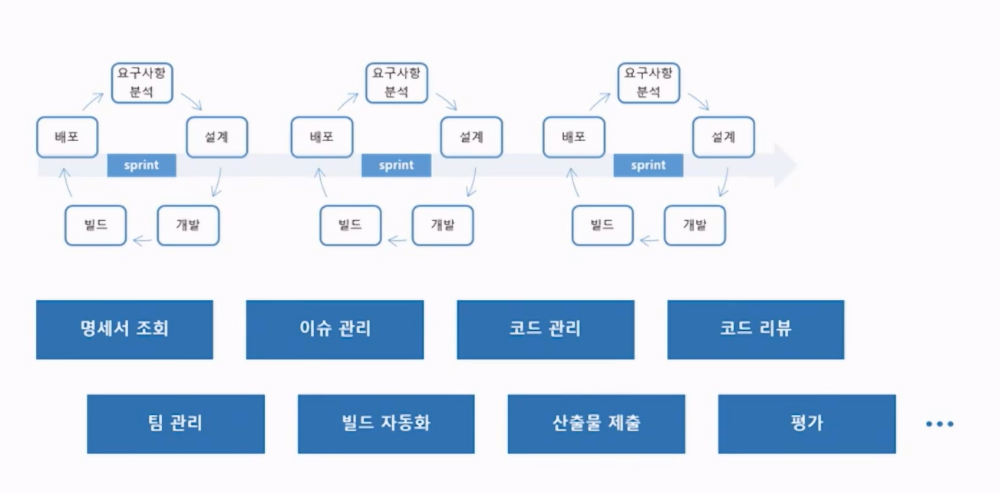
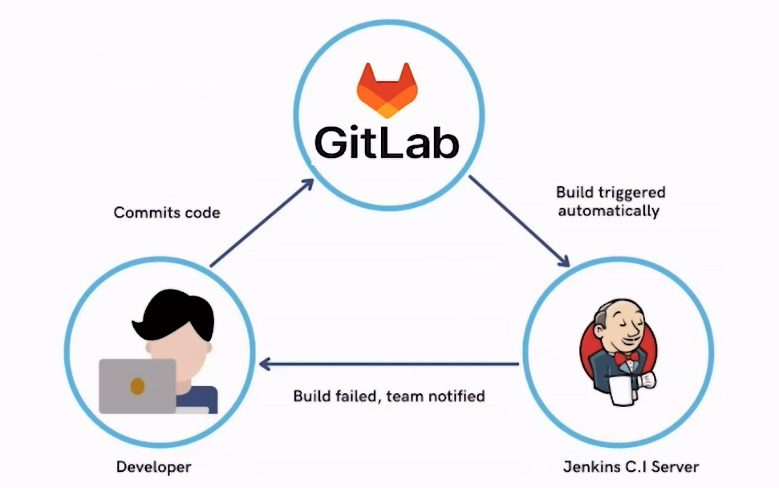

# GitLab
- 버전 컨트롤 제공하는 일종의 DevOps 시스템

# Jira
- 개발 환경에서 발생하는 이슈들을 확인하고 공유하고 기록하는 이슈 추적 관리 시스템
- 프로젝트 진행 상황을 실시간으로 확인할 수 있음
- 애자일 프로세스 기반

# Jenkins
- 여러명의 개발자가 하나의 프로젝트를 진행하다 보면 버전 변경이나 병합 등을 하면서 소스코드 버전이 충돌할 수 있음.
- Jenkins는 CI 도구. 지속적인 통합 관리
- 빌드 자동화란?
  - git 저장소에 업로드할 때마다 빌드 수행
  - 빌드할 때마다 문제점을 확인할 수 있기 때문에 오류에 대해 조기에 대처 가능
- 


1. 프로젝트 준비
   1. 팀 정보 확인
   2. 프로젝트 기본 정보 설정
2. 기능 정의서 작성
   1. 기능 정의서 양식 다운
   2. 작성
   3. 업로드
3. 이슈 관리
   1. Jira 계정확인
   2. Jira 생성
   3. 이슈 만들기 → 백로그에서 확인 가능
4. 소스코드 관리
   1. GitLab 계정확인
   2. GitLab 생성
   3. Access Token 발급(권장)
      1. 왜? -> 보안 상 문제. 만료 기간 설정할 수 있으며 username/pw 대신 사용 가능
   4. GitLab 프로젝트(Repository) 생성 - 반드시 SSAFY Git에서
   5. Project access token 발급
   6. 소스코드 업로드
        ```
        git init
        git config user.name <사용자명>
        git config user.email <이메일 주소>
        git add .
        git commit -m 'initial commit'

        git remote add origin <프로젝트의 url>
        git branch
        git push -u origin master
        ```
5. 빌드 관리
   1. GitLab token 입력 - 프로젝트 팀 정보에 Project access token 입력(Jenkins와 SSAFY Git과의 연결 위해)
   2. Jenkins 생성
   3. 빌드 진행
6. 실행 기능
   1. 실행 이미지 생성

7. 정리 단계


