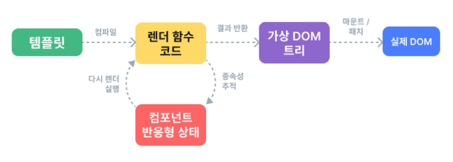

# SFC

날짜: 2024년 11월 6일
태그: Vue

[정리](https://www.notion.so/13a0a8e56dff80b8aefae9ef746eaa78?pvs=21)

# Single-File Components

## 개요

> **컴포넌트의 템플릿, 로직 및 스타일을 하나의 파일로 묶어낸 특수한 파일 형식(*.vue 파일)**
> 

**Component란?**

- 재사용 가능한 코드 블록
- UI를 독립적이고 재사용 가능한 일부분으로 분할하고 각 부분을 개별적으로 다룰 수 있음
- 자연스럽게 애플리케이션은 중첩된 Component의 트리 형태로 구성됨

## **SFC 구성요소**

- 각 ***.vue 파일**은 세가지 유형의 최상위 언어 블록 `<template>` , `<script>`, `<style>`으로 구성됨
- 언어 블록의 작성 순서는 상관 없으나 일반적으로 template → script → style 순서로 작성

### `<template>`

- 각 `*.vue` 파일은 최상위 `<template>` 블록을 하나만 포함할 수 있음

### `<script setup>`

- 각 `*.vue` 파일은 `<script setup>` 블록을 하나만 포함할 수 있음
- 컴포넌트의 `setup()` 함수로 사용되며 컴포넌트의 각 인스턴스에 대해 실행
- 변수 및 함수는 동일한 컴포넌트의 템플릿에서 자동으로 사용 가능

### `<style scoped>`

- `*.vue` 파일에는 여러 `<style>` 태그가 포함될 수 있음
- scoped가 지정되면 CSS는 현재 컴포넌트에만 적용됨

# SFC build tool

**Vite**

FE 개발 도구. 빠른 개발 환경을 위한 빌드 도구와 개발 서버를 제공

## build

- 프로젝트의 소스 코드를 최적화하고 번들링하여 배포할 수 있는 형식으로 변환하는 과정
- 개발 중에 사용되는 여러 소스 파일 및 리소스(JavaScript, CSS, 이미지 등)를 최적화된 형태로 조합하여  최종 소프트웨어 제품을 생성하는 것
- Vite는 이러한 빌드 프로세스를 수행하는 데 사용되는 도구

### 빌드하기

1. Vue pjt 생성
    
    ```bash
    npm create vue@latest
    ```
    
2. 프로젝트 이름 입력하고 전부 No로 설정
3. 프로젝트 폴더로 이동하여 패키지 설치 후 서버 실행
    
    ```bash
    cd vue-project
    npm install
    npm run dev
    ```
    

### NPM

Node.js의 기본 패키지 관리자 (파이썬의 pip 역할)

- Node.js
    - 크롬의 v8 js 엔진을 기반으로 하는 server-side 실행 환경
    - JavaScript 를 브라우저가 아닌 서버 측에서도 실행할 수 있게 함

## 모듈과 번들러

### Module

프로그램을 구성하는 독립적인 코드 블록(*.js 파일)

- 개발하는 애플리케이션의 크기가 커지고 복잡해지면서 파일 하나에 모든 기능을 담기가 어려워 짐
- 모듈을 여러 개로 분리하여 관리하게 됨
- `*.js`파일 하나가 하나의 모듈

- **Module의 한계**
    - 애플리케이션이 발전함에 따라 처리해야 하는 JavaScript 모듈의 개수도 극적으로 증가
    - 성능 병목 현상 발생, 모듈 간의 의존성이 싶어지면서 특정한 곳에서 문제가 발생했을 때 어떤 모듈 간의 문제인지 파악하기 어려워 짐
    - 복잡하고 깊은 모듈 간 의존성 문제를 해결하기 위한 도구가 필요
        
        **→ Bundler**
        

### Bundler

여러 모듈과 파일을 하나(혹은 여러 개)의 번들로 묶어 최적화 하여 애플리케이션에서 사용할 수 있게 만들어주는 도구

- 의존성 관리, 최적화, 리소스 관리 등 Bundler가 하는 작업을 Bundling이라 함
- [참고] Vite는 Rollup이라는 Bundler를 사용하며 개발자가 별도로 기타 환경설정에 신경쓰지 않도록 설정해두고 있

## Vue Project 구조

### public

- 주로 다음 정적 파일을 위치 시킴
    - 소스코드에서 참조되지 않는
    - 항상 같은 이름을 갖는
    - import할 필요 없는
- 항상 root 절대 경로를 사용하여 참조
    - `public/icon.png`는 소스코드에서 `/icon.png`로 참조 가능

## src

- 프로젝트의 주요 소스 코드를 포함하는 곳
- 컴포넌트, 스타일, 라우팅 등 프로젝트의 핵심 코드 관리

### `src/assets`

- 프로젝트 내에서 사용되는 자원(이미지,  폰트, 스타일 시트 등)을 관리
- 컴포넌트 자체에서  참조하는 내부 파일을 저장하는데 사용
- 컴포넌트가 아닌 곳에서는 public 디렉토리에 위치한 파일을 사용

### `src/components`

- Vue 컴포넌트들을 작성하는 곳

### `src/App.vue`

- Vue 앱의 최상위 root 컴포넌트
- 다른 하위 컴포넌트들을 포함
- 애플리케이션 전체의 레이아웃과 공통적인 요소를 정의

### `src/main.js`

- Vue 인스턴스를 생성하고 애플리케이션을 초기화하는 역할
- 필요한 라이브러리를 import하고 전역 설정을 수행

### index.html

- Vue 앱의 기본 HTML 파일
- 앱의 진입점 (entry point)
- App.vue가 해당 페이지에 마운트 됨
    - Vue 앱이 SPA인 이유
- 필요한 스타일 시트, 스크립트 등의 외부 리소스를 로드할 수 있음
    - 예: bootstrap CDN

# Vue Component 활용

1. 컴포넌트 파일 생성
2. 컴포넌트 등록(import)

**사전 준비**

1. 초기에 생성된 모든 컴포넌트 삭제(`App.vue` 제외)
2. `App.vue` 코드 초기화

## 컴포넌트 파일 생성

- `MyComponent.vue` 생성
    
    ```html
    <!-- src/components/MyComponent.vue -->
    
    <template>
      <div>
        <h2>MyComponent</h2>
      </div>
    </template>
    
    <script setup>
    
    </script>
    
    <style scoped>
    
    </style>
    ```
    
- App 컴포넌트에 **MyComponent** 등록
    
    ```html
    <script setup>
    import MyComponent from '@/components/MyComponent.vue'
    </script>
    
    <template>
      <h1>App.vue</h1>
      <MyComponent />  
    </template>
    
    <style scoped>
    
    </style>
    
    ```
    

컴포넌트 최상위 코드 블록은 하나만 있는 것이 좋다

(스타일가이드: [https://vuejs.org/style-guide/rules-strongly-recommended.html](https://vuejs.org/style-guide/rules-strongly-recommended.html))

# Virtual DOM

- 가상의 DOM을 메모리에 저장하고 실제 DOM과 동기화하는 프로그래밍 개념
    - `<div id="app"></div>` : Vue의 영역(VirtualDOM)
- 실제 DOM과의 변경 사항 비교를 통해 변경된 부분만 실제 DOM에 적용하는 방식
- 웹 애플리케이션의 성능을 향상시키기 위한 Vue의 내부 렌더링 기술



> 장점
> 
- 효율성
    - 실제 DOM 조작을 최소화, 변경된 부분만 업데이트하여 성능 향상
- 반응성
    - 데이터의 변경을 감지하고 Virtual DOM을 효율적으로 갱신, UI 자동 업데이트
- 추상화
    - 개발자는 실제 DOM 조작을 Vue에게 맡기고 컴포넌트와 템플릿을 활용하는 추상화된 프로그래밍 방식으로 원하는 UI 구조를 구성하고 관리할 수 있음

> 주의사항
> 
- 실제 DOM에 접근하지 말 것
    - JS에서 사용하는 DOM 접근 관련 메서드 사용 금지
    - querySelector, createElement, addEventListener
    - ref()와 Lifecycle Hooks 함수로 간접적으로 접근하여 조작할 것
- 직접 DOM 요소에 접근해야 하는 경우
    - ref 속성을 사용하여 직접적인 참조 얻기
    
    ```jsx
    <template>
    	<input ref="input">
    </template>
    ...
    // 변수명은 템플릿 ref 값과 일치해야 함
    const input = ref(null)
    ```
    

# Vue를 작성하는 2가지 스타일

## Composition API

- import해서 가져온 API 함수들을 사용하여 컴포넌트의 로직을 정의
- Vue3에서의 권장 방식
- 가독성이 좋고 직관적이다.

## Option API

- data, methods 및 mounted 같은 객체를 사용하여 컴포넌트의 로직을 정의
- 하나의 객체를 사용
- import하지 않고 객체를 작성
- Vue2에서의 작성 방식(Vue3에서도 지원)

## API 별 권장 사항

- Composition APi + SFC
    - 규모가 있는 앱의 전체를 구축하려는 경우
- Option API
    - 빌드 도구를 사용하지 않거나 복잡성이 낮은 프로젝트에서 사용하려는 경우
- [https://vuejs.org/guide/extras/composition-api-faq](https://vuejs.org/guide/extras/composition-api-faq)

# 참고

## Single Root Element

**모든 컴포넌트에는 최상단 HTML 요소가 한개만 작성되는 것이 권장**

- 가독성, 스타일링, 명확한 컴포넌트 구조를 위해 각 컴포넌트에는 최상단 HTML 요소를 한개만 작성해야 함 (Single Root Element)
- 최상단 HTML 요소 하나 → 얘 하나가 컴포넌트 하나구나

## CSS scoped

### SFC의 CSS 기능 - scoped

- scoped 속성을 사용하면 해당 CSS는 현재 컴포넌트의 요소에만 적용됨
    - 부모 컴포넌트의 스타일이 자식 컴포넌트로 유출되지 않음
    - scoped 사용하지 않으면 모든 컴포넌트에 영향을 미침
- **단, 자식 컴포넌트의 최상위 요소는 영향을 받음**
    
    ```html
    <!-- MyComponent.vue -->
    
    <template>
      <div>
    	  <h2>MyComponent</h2>
      </div>
    </template>
    ```
    
    ```html
    <!-- App.vue -->
    
    <script setup>
    import MyComponent from '@/components/MyComponent.vue'
    </script>
    
    <template>
      <h1>App.vue</h1>
      <MyComponent />
      <!--
    	<div>
    	  <h2>MyComponent</h2>
      </div>
      -->
      
    </template>
    
    <style scoped>
    div {
    	color: red;
    }
    </style>
    ```
    
    - 자식 컴포넌트의 최상위 요소는 부모에서 사용되기 때문
        - `App.vue`의 `<template>`에 h1태그와 MyComponent의 div 태그가 병렬적으로 연결된 것과 같음
    - 태그 대신 클래스 선택자로 하면 이를 방지할 수 있음
        - 예: `div` 대신 `.div-border` 사용

## Scafolding

- 새로운 프로젝트나 모듈을 시작하기 위해 초기 구조와 기본 코드를 자동으로 생성하는 과정
- 초기 설정, 폴더 구조, 파일 템플릿, 기본 코드 등을 자동으로 생성하여 개발자들이 프로젝트를 시작하는 데 도움을 주는 틀이나 기반을 제공

**관심사항의 분리 ≠ 파일 유형의 분리**

- HTML / CSS / JS를 한 파일에 혼합하는 게 괜찮을까?
- FE 앱이 복잡해짐에 따라 단순 파일 유형으로만 분리하는 것은 프로젝트의 목표를 달성하는 데 도움이 되지 않게 됨
- 따라서 사용 목적에 따른 분리 필요!!