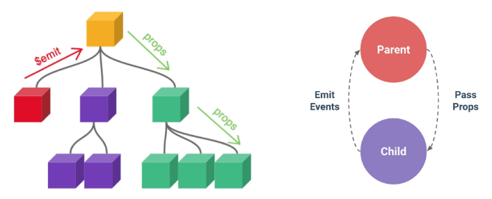

# Component State Flow

날짜: 2024년 11월 7일

[정리](https://www.notion.so/13a0a8e56dff8004aba8efc2b6781b77?pvs=21)

# Passing Props

## Props

**부모 컴포넌트로부터 자식 컴포넌트로 데이터를 전달하는데 사용되는 속성**

- 만약 동일한 사진 데이터가 한 화면에 다양한 위치에서 여러 번 출력되고 있다면 ?
    
    → 동일한 데이터, 다른 컴포넌트
    
- 각 컴포넌트가 개별적으로 동일한 데이터를 관리해야 할까?
- 공통된 부모 컴포넌트에서 관리하자



→ 부모는 자식에게 데이터를 전달(Pass props) 하며, 자식은 자신에게 일어난 일을 부모에게 알림(Emit event)

### Props 특징

- **One-Way Data Flow**
    - 부모 속성이 업데이트되면 자식으로 전달되지만 그 반대는 안됨
    - 자식 컴포넌트 내부에서 props를 변경하려고 시도해서는 안되며 불가능하다.
- 부모 컴포넌트가 업데이트 될 때마다 이를 사용하는 자식 컴포넌트의 모든 props가 최신 값으로 업데이트 됨
    
    → 부모 컴포넌트에서만 변경하고 이를 내려받는 자식 컴포넌트는 자연스럽게 갱신됨
    

### One-way Data Flow

모든 props는 자식 속성과 부모 속성 사이에 하향식 단방향 바인딩을 형성

- 왜 단방향?
    - 하위 컴포넌트가 실수로 상위 컴포넌트의 상태를 변경하여 앱에서의 데이터 흐름을 이해어렵게 만드는 것을 방지하기 위함
    - 데이터 흐름의 **일관성** 및 **단순화**

## Props 선언

**사전준비**

1. vue 프로젝트 생성
2. 초기 생성된 컴포넌트 모두 삭제(`App.vue` 제외)
3. `scr/assets` 내부 파일 모두 삭제
4. `main.js` css 관련 파일 삭제
5. App > Parent > ParentChild 컴포넌트 관계 작성
    - `App.vue`
    
    ```html
    <template>
      <div>
    	  <Parent />
      </div>
    </template>
    
    <script setup>
    import ParentChild from '@/components/Parent.vue'
    </script>
    ```
    
    - `Parent.vue`
    
    ```html
    <template>
      <div>
        <ParentChild />
      </div>
    </template>
    
    <script setup>
    import ParentChild from '@/components/ParentChild.vue'
    </script>
    ```
    
    - `ParentChild.vue`
    
    ```html
    <template>
      <div></div>
    </template>
    
    <script setup>
    </script>
    ```
    

**Props 선언**

부모 컴포넌트에서 내려 보낸 props를 사용하기 위해서는 자식 컴포넌트에서 명시적인 props 선언이 필요

- 부모 컴포넌트 Parent에서 자식 컴포넌트 ParentChild에 보낼 props 작성
    
    ```html
    <template>
      <div>
        <ParentChild my-msg="message"/>
      </div>
    </template>
    ```
    
    - html 속성은 kebab-case 아니면 전부 소문자로 작성
    - JS는 `-` 기준으로 대문자로 작성
- `defineProps()`를 사용하여 `ParentChild`에 props를 선언
    - 인자의 데이터 타입에 따라 선언 방식이 나뉨
    
    ```html
    <script setup>
    defineProps()
    </script>
    ```
    
    1. 문자열 배열을 사용한 선언
        
        ```html
        <script setup>
        defineProps(['myMsg'])
        </script>
        ```
        
    2. 객체를 사용한 선언
        
        ```html
        <script setup>
        defineProps({
        	myMsg: String
        })
        </script>
        ```
        
- props 데이터 사용
    - props 선언 후 템플릿에서 반응형 변수와 같은 방식으로 활용
        
        ```html
        <div>
        	<p>{{ myMsg }}</p>
        </div>
        ```
        
    - props를 객체로 반환하므로 필요한 경우 JS에서 접근 가능
        
        ```html
        <script setup>
        const props = defineProps({ myMsg: String})
        console.log(props)
        console.log(props.myMsg)
        </script>
        ```
        
- 한 단계 더 props 내려 보내기
    - ParentChild 컴포넌트를 부모로 갖는 ParentGrandChild 컴포넌트 생성 및 등록
    
    ```html
    <!-- ParentChild.vue -->
    
    <template>
      <div>
    	  <p>{{ myMsg }}</p>
    	  <ParentGrandChild />
      </div>
    </template>
    
    <script setup>
    import ParentGrandChild from '@/components/ParentGrandChild.vue'
    
    defineProps({
    	myMsg: String,
    })
    </script>
    ```
    
    - ParentChild 컴포넌트에서 Parent로부터 받은 props인 myMsg를 ParentGrandChild에게 전달
    
    ```html
    <!-- ParentChild.vue -->
    
    <template>
      <div>
    	  <p>{{ myMsg }}</p>
    	  <ParentGrandChild  :my-msg="myMsg"/>  <!-- v-bind를 사용한 동적 props -->
      </div>
    </template>
    ```
    
    ```html
    <!-- ParentGrandChild.vue -->
    
    <template>
      <div>
    	  <p>{{ myMsg }}</p>
      </div>
    </template>
    
    <script setup>
    defineProps({
    	myMsg: String,
    })
    </script>
    ```
    

## Static props

- 지금까지 작성한 props

## Dynamic props

- `v-bind`를 사용하여 동적으로 할당된 props
1. 부모 컴포넌트에 Dynamic props 정의
    
    ```html
    <template>
      <div>
        <ParentChild my-msg="message" :dynamic-props="name"/>
      </div>
    </template>
    
    <script setup>
    import { ref } from 'vue'
    const name = ref('Alice')
    </script>
    ```
    
2. 자식 컴포넌트에 Dynamic props 선언 및 출력
    
    ```html
    defineProps({
    	myMsg: String,
    	dynamicProps: String,
    })
    
    ...
    <p>{{ dynamicProps }}</p>
    ```
    

### Directive와 함께 사용하기

**예제: `v-for`와 함께 사용하여 반복되는 요소를 props로 전달**

- ParentItem 컴포넌트 생성 및 Parent의 하위 컴포넌트로 등록
    
    ```html
    <!-- Parent.vue -->
    
    <template>
    	<div>
    		<ParentItem />
    	</div>
    </template>
    
    <script setup>
    import ParentItem from '@/components/ParentItem.vue'
    </script>
    ```
    
- 데이터 정의
    
    ```html
    <!-- Parent.vue -->
    
    const items = ref([
    	{ id: 1, name: '사과' },
    	{ id: 2, name: '바나나' },
    	{ id: 3, name: '딸기' },
    ])
    ```
    
- `v-for` 디렉티브의 반복 요소로 활용, 각 반복 요소를 props로 내려 보내기
    
    ```html
    <!-- Parent.vue -->
    
    <ParentItem
    	v-for="item in items"
    	:key="item.id"
    	:my-prop="item"
    />
    ```
    
- props 선언 및 출력 결과 확인
    
    ```html
    <!-- Parent.vue -->
    
    <template>
    	<div>
    		<p>{{ myProp.id }}</p>
    		<p>{{ myProp.id }}</p>
    	</div>
    </template>
    
    <script setup>
    defineProps({
    	myProp: Object
    })
    </script>
    ```
    

# Component Events(Emit)

## Emit

자식은 일어난 일을 부모에게 알림(Emit event)

부모가 props 데이터를 변경하도록 소리쳐야 한다.

## **`$emit()`**

자식 컴포넌트가 이벤트를 발생시켜 부모 컴포넌트로 데이터를 전달하는 역할의 메서드

- `$` 표기는 Vue 인스턴스의 내부 변수들을 가리킴
- Life Cycle Hooks, 인스턴스 메서드 등 내부 특정 속성에 저븍ㄴ할 대 사용

### **메서드 구조**

`$emit(event, ...args)`

- event
    - 커스텀 이벤트 이름
- args
    - 추가 인자

## 이벤트 발신 및 수신

- 자식 컴포넌트에서 someEvent라는 이름의 사용자 정의 이벤트를 발신
    
    ```html
    <template>
    	<button @click="$emit('someEvent')">클릭</button>
    </template>
    ```
    
- 부모 컴포넌트는 `v-on`을 사용하여 발신된 이벤트를 수신
    
    ```html
    <ParentChild @some-event="someCallback" my-msg="message" :dynamic-props=name" />
    ```
    
- 수신 후 처리할 로직 및 콜백함수 호출
    
    ```jsx
    const someCallback = function () {
    	console.log('ParentChild가 발신한 이벤트를 수신했어요.
    }
    ```
    

## emit 이벤트 선언

**위의 방식보다 이 방식을 더 권장한다.**

- `defineEmits()`를 사용하여 발신할 이벤트를 선언
- props와 마찬가지로 `defineEmits()` 에 작성하는 인자의 데이터 타입에 따라 선언 방식이 나뉨(배열, 객체)
- `defineEmits()`는 `$emit` 대신 사용할 수 있는 동등한 함수를 반환(script에서는 `$emit` 메서드에 접근 불가)

```html
<script setup>
const emit = defineEmits(['someEvent', 'myFocus'])

const buttonClick = function () {
	emit('someEvent')
}
</script>
...
<template>
	<button @click="buttonClick">클릭</button>
</template>
```

### 이벤트 전달

이벤트 발신 시 추가 인자를 전달하여 값을 제공할 수 있음

- ParentChild에서 이벤트를 발신하여 Parent로 추가 인자 전달하기
    
    ```jsx
    const emit = defineEmits(['someEvent', 'emitArgs'])
    
    const emitArgs = function () {
    	emit('emitArgs', 1, 2, 3)
    }
    ...
    <template>
    	<button @click="emitArgs">버튼 클릭 시 추가 인자 전달</button>
    </template>
    ```
    
- ParentChild에서 발신한 이벤트를 Parent에서 수신
    
    ```jsx
    <ParentChild
    	@emit-args="getNumbers"  // emitArgs 이벤트 수신 시 getNumbers 콜백 함수 실행
    	...
    />
    ...
    
    const getNumbers = function () {
    	console.log(`ParentChild가 전달한 추가 인자 ${args}를 수신했어요.`)
    }
    ```
    

## emit 이벤트 실습

- 최하단 컴포넌트 ParentGrandChild에서 Parent 컴포넌트의 name 변수 변경 요청하기


- ParentGrandChild에서 변경 요청하는 이벤트 발신
    
    `ParentGrandChild.vue`
    
    ```jsx
    const emit = defineEmits(['updateName'])
    
    const updateName = function () {
    	emit('updateName')
    }
    ...
    <button @click="updateName">이름 변경</button>
    ```
    
- ParentChild에서 수신 후 다시 Parent로 발신
    
    `ParentChild.vue`
    
    ```jsx
    const emit = defineEmits([..., 'updateName'])
    
    const updateName = function () {
    	emit('updateName')
    }
    ...
    
    <ParentGrandChild	@update-name="updateName"/>
    ```
    
- Parent에서 수신 후 변경하는 메서드(콜백함수) 실행
    
    `Parent.vue`
    
    ```jsx
    <ParentChild @update-name="updateName"/>
    ...
    const updateName = function () {
    	name.value = 'Bella'	
    }
    ```
    
    - 해당 변수(name)를 props로 받는 모든 곳에서 자동 업데이트 됨

# 참고

## 정적 & 동적 props 주의사항

- 정적 props: 문자열 1을 전달
    - HTML의 영역
    
    ```jsx
    <SomeComponent num-props="1" />
    ```
    
- 동적 props: 숫자 1을 전달
    - JS의 영역
    
    ```jsx
    <SomeComponent :num-props="1" />
    ```
    

## Props 선언 시 객체 선언 문법을 권장하는 이유

- 컴포넌트를 가독성 좋게 문서화하는 데 도움이 된다
- 다른 개발자가 잘못된 타입을 전달할 때, 브라우저 콘솔에 경고를 출력함으로써 유효성 검사 진행 가능
    
    ```jsx
    defineProps({
    	// 여러 타입 허용
    	propB: [String, Number],
    	// 문자열 필수
    	propC: {
    		type: String,
    		required: true
    	},
    	// 기본 값을 가지는 숫자형
    	propD: {
    		type: Number,
    		default: 10
    	},
    	...
    })
    
    ```
    
- emit 이벤트 또한 객체 선언 문법 사용 시 유효성 검사할 수 있다.
    
    ```jsx
    const emit = defineEmits({
    	// 유효성 검사 없음
    	click: null,
    	// submit 이벤트에 대해서만 유효성 검사	
    	submit: ({ email, password }) => {
    		if (email && password) {
    			return true
    		} else {
    			console.warn('submit 이벤트가 옳지 않음')
    			return false
    		}
    	}
    })
    const submitForm = function (email, password) {
    	emit('submit', { email, password })
    }
    ```
    


