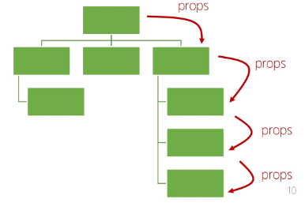

# Vue State Management

날짜: 2024년 11월 12일
태그: Vue

# State Management

- Vue 컴포넌트는 이미 반응형 상태(데이터)를 관리하고 있음
- Vue의 트리 구조가 복잡해지면 prop + emit만으로는 관리가 어려워진다.

**컴포넌트 구조의 단순화(단방향 데이터 흐름의 간단한 표현)**

- 상태(State)
    - 앱 구동에 필요한 기본 데이터
- 뷰(Views)
    - 상태를 선언적으로 매핑하여 시각화
- 기능(Actions)
    - 뷰에서 사용자 입력에 대해 상태를 변경할 수 있게 정의된 동작

**언제 무너지는가?**

→ 여러 컴포넌트가 상태를 공유할 때. 즉, 소스 하나 당 여러개가 컨트롤 할 때

1. 여러 vue가 동일한 상태에 종속되는 경우
    - 공유 상태를 공통 조상 컴포넌트로 끌어올린 후 props로 전달
    - 계층 구조가 깊어질 경우 비효율적. 관리가 어려워 짐.
    
    
    
2. 서로 다른 vue의 기능이 동일한 상태를 변경시켜야 하는 경우
    - emit된 이벤트를 통해 상태의 여러 복사본을 변경 및 동기화
    - 관리의 패턴이 깨지기 쉽고 유지 관리할 수 없는 코드가 됨
    
    
    

어떻게 해결?

각 컴포넌트의 공유 상태를 추출하여 전역에서 참조할 수 있는 저장소에서 관리(중앙 저장소)

컴포넌트 트리는 하나의 큰 View가 되고 모든 컴포넌트는 트리 계층 구조에 관계 없이 상태에 접근하거나 기능을 사용할 수 있음

# Pinia

**Vue의 공식 상태 관리 라이브러리**

- Vite 프로젝트 빌드 시 Pinia 라이브러리 추가하여 설치
- stores 폴더 신규 생성

```jsx
// stores/counter.js

import { ref, computed } from 'vue'
import { defineStore } from 'pinia'

export const useCounterStore = defineStore('counter', () => {
  const count = ref(0)
  const doubleCount = computed(() => count.value * 2)
  function increment() {
    count.value++
  }

  return { count, doubleCount, increment }
})

```

## 구성요소

1. **store**
2. **state**
3. **getters**
4. **actions**
5. **plugin**

### store

- 중앙 저장소
- **모든 컴포넌트가 공유**하는 상태, 기능 등이 작성됨
    - `defineStore()`의 반환 값의 이름은 use와 store를 사용하는 것을 권장
    - `defineStore()`의 첫번째 인자는 중앙 저장소의 이름이자, 애플리케이션 전체에 걸쳐 사용하는 store의 고유 ID

### state

- 반응형 상태(데이터)
- ref() === state

### getters

- 계산된 값
- computed() === getters

### actions

- 메서드
- function () === actions

### plugin

- 애플리케이션의 상태 관리에 필욯나 추가 기능을 제공하거나 확장하는 모듈
- 패키지 매니저로 설치 이후 별도 설정을 통해 추가됨

**[참고]**

- pinia의 상태들을 다른 컴포넌트에서 접근하여 활용하려면 return에 포함시켜야 함
- store에서는 공유하지 않는 private한 상태 속성을 작성하지 않는다.
    - 즉, 목적에 맞지 않는 데이터는 작성 X
- 하나의 프로젝트에서 사용 목적에 따라 여러 store를 가질 수 있음

## 구성 요소 활용

### State

- 각 컴포넌트 깊이에 관계 없이 store 인스턴스로 state에 접근하여 직접 읽고 쓸 수 있음
- store에 state를 정의하지 않았다면 컴포넌트에서 새로 추가할 수 없음

```jsx
// useCounterStore: stores/counter.js 에서 export 한 것
import { useCounterStore } from '@/stores/counter'

const store = useCounterStore()

console.log(store.count)
const newNumber = store.count + 1
```

```jsx
<p>state: {{ store.count }}</p>
```

### Getters

- store의 모든 getters 또한 state처럼 직접 접근할 수 있음

```jsx
console.log(store.doubleCount)
```

```html
<p>getters: {{ store.doubleCount }}</p>
```

### Actions

- store의 모든 actions 또한 직접 접근 및 호출할 수 있음

```jsx
store.increment()
```

- getters와 달리 state 조작, 비동기, API 호출이나 다른 로직을 진행할 수 있음

```jsx
<template>
  <div>
	  <button @click="store.increment()">+++</button>
  </div>
</template>
```

# Pinia를 활용한 Todo 구현

- Todo CRUD 구현
- Todo 개수 계산
    - 완료된 Todo 개수


**사전 준비**

- 초기화
    - 초기 생성된 컴포넌트 모두 삭제 (App.vue 제외)
    - `scr/assets` 내부 파일 모두 삭제
    - `main.js` 해당 코드 삭제
- **TodoListItem** 컴포넌트 작성
- **TodoList** 컴포넌트 작성 후 **TodoListItem** 컴포넌트 등록
- **TodoForm** 컴포넌트 작성
- `App.vue`에 **TodoList, TodoForm** 컴포넌트 등록

### Read Todo

- `stores/counter.js` : todos 목록 state 정의
    
    ```jsx
    let id = 0
    const todos = ref([
    	{ id: id++, text: '할 일1', isDone: false },
    	{ id: id++, text: '할 일2', isDone: false },
    ])
    
    return { todos }
    ```
    
- `TodoList.vue` : store의 todos state를 참조하여 개별 todo를 props로 전달
    
    ```jsx
    <template>
        <div>
            TodoList
            <TodoListItem 
                v-for="todo in store.todos"
                :key="todo.id"
                :todo="todo"
            />
        </div>
    </template>
    
    <script setup>
    import TodoListItem from '@/components/TodoListItem.vue'
    import { useCounterStore } from '@/stores/counter'
    
    const store = useCounterStore()
    // console.log(store.todos)
    </script>
    
    <style scoped>
    </style>
    ```
    
- `TodoListItem.vue` : props 정의 후 출력
    
    ```jsx
    <template>
        <div>{{ todo.text }}</div>
    </template>
    
    <script setup>
    defineProps({
        todo: Object
    })
    </script>
    
    <style scoped>
    </style>
    ```
    

### Create Todo

- `stores/counter.js` : todos 목록에 todo를 생성 및 추가하는 addTodo 액션 정의
    
    ```jsx
    const addTodo = function (todoText) {
      todos.value.push({
        id: id++,
        text: todoText,
        isDone: false
      })
    }
    
    return { todos, addTodo, deleteTodo, updateTodo, doneTodosCount }
    
    ```
    
- `TodoForm.vue` : TodoForm에서 addTodo action 참조
    - TodoForm에서 실시간으로 입력되는 사용자 데이터를 양방향 바인딩하여 반응형 변수로 할당
    - submit 이벤트가 발생했을 때 사용자 입력 텍스트를 인자로 전달하여 store에 정의한 addTodo 액션 메서드를 호출
    - form요소를 선택하여 todo 입력 후 input 데이터를 초기화 할 수 있도록 처리
    
    ```jsx
    <template>
      <div>
    	  <form>
    	    <input type="text" v-model="todoText">
    	    <input type="submit">
        </form>
    	</div>
    </template>
    
    <script setup>
    import { useCounterStore } from '@/stores/counter'
    import { ref } from 'vue'
    
    const store = useCounterStore()
    const todoText = ref('')
    
    const formElem = ref(null)
    
    const createTodo = function (todoText) {
        store.addTodo(todoText)
        formElem.value.reset()
    }
    </script>
    
    <style scoped>
    </style>
    ```
    

### Delete Todo

- `TodoListItem.vue` : 각 todo에 삭제 버튼 작성. 이 삭제 버튼을 누르면 해당 todo가 삭제되도록 todo의 id를 인자로 전달해 deleteTodo 메서드 호출
    
    ```jsx
    import { useCounterStore } from '@/stores/counter'
    
    const store = useCounterStore()
    ```
    
    ```jsx
    <div>
      <span>{{ todo.text }}</span>
      <button @click="store.deleteTodo(todo.id)">삭제</button>
    </div>
    ```
    
- `stores/counter.js` : todos 목록에서 특정 todo를 삭제하는 deleteTodo 액션 정의. 전달받은 todo의 id값으로부터 선택된 todo의 인덱스를 구함. 해당 인덱스의 todo 삭제 후 todos 배열 재설정
    
    ```jsx
    const deleteTodo = function (selectedId) {
        const index = todos.value.findIndex((todo) => todo.id === selectedId)
        todos.value.splice(index, 1)
      }
    
    return { todos, addTodo, deleteTodo }
    ```
    

### Update Todo

- 각 todo 상태의 isDone 속성을 변경하여 todo의 완료 유무 처리하기
- 완료된 todo에는 취소선 스타일 적용하기
- `stores/counter.js` : todos 목록에서 특정 todo의 isDone 속성을 변경하는 updateTodo 액션 정의. 전달받은 id 값을 활용함.
    
    ```jsx
    const updateTodo = function(todoId) {
        todos.value = todos.value.map((todo) => {
          if (todo.id === todoId) {
            todo.isDone = !todo.isDone
          }
          return todo
        })
      }
    	return { todos, addTodo, deleteTodo, updateTodo }
    })
    ```
    
- `TodoListItem.vue` : todo 내용을 클릭하면 선택된 todo의 id를 인자로 전달하여 updateTodo 메서드 호출. isDone 값에 따라 클래스 속성하고 css 선택자 설정하기.
    
    ```jsx
    <template>
      <div>
        <span @click="store.updateTodo(todo.id)" :class="{ 'is-done': todo.isDone }">{{ todo.text }}</span>
        <button @click="store.deleteTodo(todo.id)">삭제</button>
      </div>
    </template>
    
    <style scoped>
    .is-done {
      text-decoration: line-through;
    }
    </style>
    ```
    

### Counting Todos

- `stores/counter.js` : todos 배열의 길이 값을 반환하는 getter 작성
    
    ```jsx
    	const doneTodosCount = computed (() => {
        const doneTodos = todos.value.filter((todo) => todo.isDone)
        return doneTodos.length 
      })
    
      return { todos, addTodo, deleteTodo, updateTodo, doneTodosCount }
    })
    ```
    
- **`App.vue` : App** 컴포넌트에서 위의 getter 참조
    
    ```jsx
    <template>
      <header>
        <h1>Todo Project</h1>
        <h2>완료된 Todo 개수: {{ store.doneTodosCount }}</h2>
      </header>
    
      <main>
        <TodoList />
        <TodoForm />
      </main>
    </template>
    
    <script setup>
    import {useCounterStore} from '@/stores/counter'
    import TodoForm from '@/components/TodoForm.vue'
    import TodoList from '@/components/TodoList.vue'
    
    const store = useCounterStore()
    </script>
    
    <style scoped>
    </style>
    
    ```
    

## Local Storage

브라우저 내에 key-value 쌍을 저장하는 웹 스토리지 객체

- 페이지를 새로고침하고 브라우저를 다시 실행해도 데이터가 유지
- 쿠키와 다르게 네트워크 요청 시 서버로 전송되지 않음
- 여러 탭이나 창 간에 데이터를 공유할 수 있음
- 클라이언트 측에서 사용자 설정, 상태정보, 캐시 데이터 등을 보관
    
    ⇒ 웹사이트 성능 향상 및 사용자 경험 개선
    

### pinia-plugin-persistedstate

- Pinia의 플러그인 중 하나
- 웹 애플리케이션의 상태를 브라우저의 local storage나 session storage에 영구적으로 저장하고 복원하는 기능을 제공
- [https://prazdevs.github.io/pinia-plugin-persistedstate/](https://prazdevs.github.io/pinia-plugin-persistedstate/)
- 설치 및 등록하기
    
    ```bash
    $ npm i pinia-plugin-persistedstate
    ```
    
    ```jsx
    // main.js
    
    import { createApp } from 'vue'
    import { createPinia } from 'pinia'
    import piniaPluginPersistedstate from 'pinia-plugin-persistedstate'
    import App from './App.vue'
    
    const app = createApp(App)
    const pinia = createPinia()
    
    pinia.use(piniaPluginPersistedstate)
    
    app.use(pinia)
    // app.use(createPinia())
    
    app.mount('#app')
    
    ```
    
    ```jsx
    // stores/counter.js
    
    export const useCounterStore = defineStore('counter', () => {
      ...
    
      return { todos, addTodo, deleteTodo, updateTodo, doneTodosCount }
    }, { persist: true })   // defineStore()의 세번째 인자로 { persist: true } 객체 추가 
    
    ```
    

### 사용 예시

- DRF와 Vue를 같이 쓸 때, 매 컴포넌트 마다 인증을 요구한다면?
    
    → 로컬 스토리지에 인증키 저장하면 매번 인증키를 전송할 필요가 없다.
    

# 참고

### 이제 모든 데이터를 store에서 관리해야 할까?

- Pinia 사용한다고 해서 모든 데이터를 state에 넣어야 할 필요는 없다
- props, emit 을 함게 사용하여 애플리케이션을 구성해야 함
- 상황에 따라 적절하게 사용하는 것이 필요

### Pinia, 언제 사용해야 할까?

- Pinia는 공유된 상태를 관리하는 데 유용하지만, 구조적인 개념에 대한 이해와 시작하는 비용이 큼
- 애플리케이션이 단순하다면 Pinia가 없는 것이 더 효율적일 수 있음
- 중대형 규모의 SPA를 구축하는 경우 Pinia는 자연스럽게 선택될 것이다.
- 결과적으로 적절한 상황에서 활용했을 때 Pinia의 효용을 극대화할 수 있음